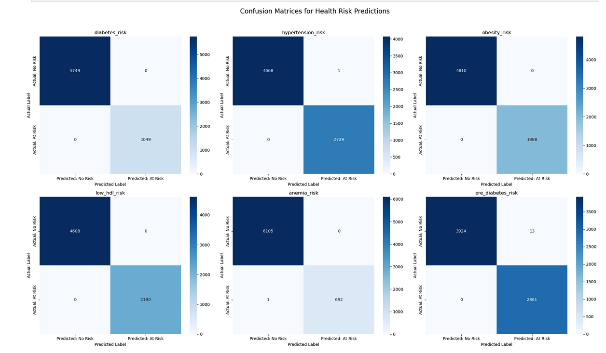

# Health Risk Predictor

This project uses machine learning to predict six common health risks based on data from the National Health and Nutrition Examination Survey (NHANES). The primary goal is to build a reliable pipeline for identifying individuals at risk for specific health conditions using their demographic, laboratory, and dietary data.

---

## 📋 Features

The model predicts the risk for the following six health conditions:
* Diabetes
* Pre-Diabetes
* Hypertension
* Obesity
* Low HDL Cholesterol
* Anemia

---

## 📊 Dataset

The model is trained on a cleaned and merged dataset derived from the public-use files of the NHANES. The core data categories used are:
* **Demographics (`demographics_clean.csv`)**: Contains participant information like age, gender, and ethnicity.
* **Response (`response_clean.csv`)**: A pre-merged file containing key laboratory results and physical examination data (e.g., blood pressure, BMI, glucose levels).
* **Dietary (`dietary_clean.csv`)**: Contains detailed nutritional intake data for participants.

---

## ⚙️ Methodology

The project follows a standard machine learning workflow:

1.  **Data Preparation**: Loaded and merged the key datasets. Handled a significant number of missing values by removing incomplete records to ensure a high-quality dataset for training.
2.  **Target Creation**: Engineered six binary target variables (the health risks) based on established clinical guidelines (e.g., `diabetes_risk` is defined by specific glucose and A1c levels).
3.  **Model Training**: Trained six separate **Random Forest Classifiers**, one for each health risk. This specialized approach allows each model to learn the specific patterns for a single condition. The severe class imbalance in the dataset was addressed using the `class_weight='balanced'` parameter.
4.  **Evaluation**: Assessed each model's performance using a comprehensive set of metrics, including **Precision, Recall, F1-Score, and AUC**.

---

## 📈 Results

The models demonstrate strong predictive performance, particularly in identifying at-risk individuals (high recall). The heatmap below summarizes the classification scores, providing a clear overview of the model's effectiveness across all six prediction tasks.

---
